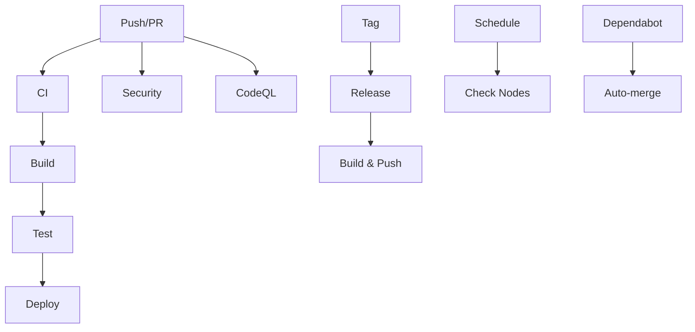

# IPPAN CI/CD Pipeline Guide

## Overview

This document describes the CI/CD pipeline for the IPPAN blockchain project, including all workflows, their purposes, and how to maintain them.

## Workflow Structure

### Core Workflows

1. **`ci.yml`** - Main CI pipeline
   - Runs on: `main`, `develop` branches and PRs
   - Tests: Rust code (formatting, clippy, build, test)
   - Tests: Gateway Node.js code (lint, build, security audit)

2. **`test.yml`** - Comprehensive test suite
   - Runs: Unit tests, integration tests, gateway tests
   - Includes: Docker-based integration testing

3. **`build.yml`** - Docker image building
   - Builds: IPPAN blockchain node and gateway images
   - Pushes: To GitHub Container Registry (GHCR)

### Security & Quality

4. **`security.yml`** - Security scanning
   - Runs: Trivy vulnerability scanner, Rust audit, Node.js audit
   - Includes: License compliance checking
   - Schedule: Daily at 2 AM UTC

5. **`codeql.yml`** - Code quality analysis
   - Languages: Rust, JavaScript/TypeScript
   - Schedule: Weekly on Mondays at 3 AM UTC

### Deployment

6. **`prod-deploy.yml`** - Production deployment
   - Deploys: To primary and secondary servers
   - Includes: Health checks and P2P connectivity verification

7. **`deploy-fix.yml`** - Deployment repair
   - Fixes: Stuck deployments, connectivity issues
   - Includes: Service restart and health verification

8. **`check-nodes.yml`** - Node health monitoring
   - Schedule: Every 30 minutes
   - Checks: API health endpoints

### Release Management

9. **`release.yml`** - Release automation
   - Triggers: On version tags (v*)
   - Creates: GitHub releases with changelog
   - Builds: Docker images for release

10. **`dependabot.yml`** - Dependency management
    - Auto-merges: Minor and patch updates
    - Requires: Dependabot bot actor

## Configuration Requirements

### Required Secrets

- `DEPLOY_HOST` - Primary server hostname/IP
- `DEPLOY_PORT` - SSH port (usually 22)
- `DEPLOY_USER` - SSH username
- `DEPLOY_SSH_KEY` - Private SSH key
- `DEPLOY_FINGERPRINT` - SSH key fingerprint
- `SECONDARY_FINGERPRINT` - Secondary server SSH fingerprint

### Required Variables

- `SECONDARY_HOST` - Secondary server hostname/IP
- `NEXT_PUBLIC_API_BASE_URL` - API base URL for health checks

### Repository Settings

1. **Actions permissions**: Allow all actions and reusable workflows
2. **Dependabot**: Enable for Rust (Cargo.toml) and Node.js (package.json)
3. **Security**: Enable Dependabot alerts and secret scanning
4. **Packages**: Enable GitHub Container Registry

## Workflow Dependencies



## Maintenance Tasks

### Regular Updates

1. **Action versions**: Update to latest stable versions monthly
2. **Dependencies**: Review and update Rust/Node.js dependencies
3. **Security**: Review security scan results weekly
4. **Performance**: Monitor workflow execution times

### Troubleshooting

#### Common Issues

1. **Build failures**:
   - Check Rust toolchain compatibility
   - Verify Docker build context
   - Review dependency versions

2. **Deployment failures**:
   - Verify SSH connectivity
   - Check server resources
   - Review firewall settings

3. **Security scan failures**:
   - Update vulnerable dependencies
   - Review license compliance
   - Address Trivy findings

#### Debug Commands

```bash
# Validate CI/CD configuration
.github/scripts/validate-cicd.sh

# Check workflow syntax
yamllint .github/workflows/*.yml

# Test deployment connectivity
ssh -i $DEPLOY_SSH_KEY $DEPLOY_USER@$DEPLOY_HOST "docker ps"
```

## Best Practices

### Workflow Design

1. **Fail fast**: Use `fail-fast: false` only when necessary
2. **Caching**: Always cache dependencies and build artifacts
3. **Permissions**: Use minimal required permissions
4. **Secrets**: Never log secrets or use them in public contexts

### Security

1. **Dependencies**: Pin action versions to specific commits
2. **Secrets**: Rotate SSH keys and tokens regularly
3. **Access**: Limit deployment permissions to necessary users
4. **Monitoring**: Set up alerts for failed deployments

### Performance

1. **Parallel jobs**: Run independent jobs in parallel
2. **Caching**: Use appropriate cache keys and restore keys
3. **Resource limits**: Set reasonable timeouts and resource limits
4. **Cleanup**: Remove old artifacts and containers

## Monitoring & Alerting

### Key Metrics

- Workflow success rate
- Build time trends
- Security scan results
- Deployment frequency
- Node health status

### Alert Conditions

- Workflow failures
- Security vulnerabilities
- Node connectivity issues
- Deployment failures
- Resource exhaustion

## Future Improvements

1. **Multi-environment**: Add staging environment
2. **Blue-green deployment**: Implement zero-downtime deployments
3. **Advanced monitoring**: Add Prometheus metrics
4. **Automated rollback**: Implement failure detection and rollback
5. **Performance testing**: Add load testing to CI pipeline
