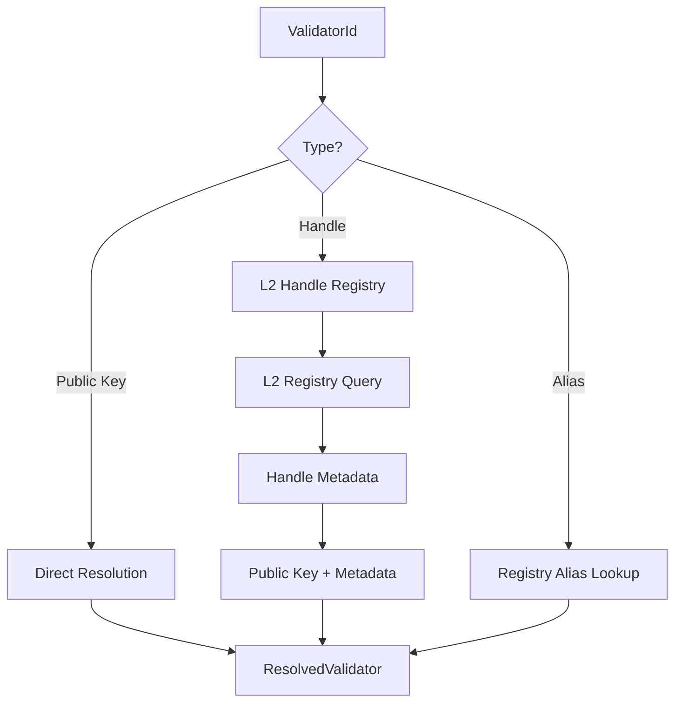

# L2 Handle System Architecture

## Overview

The IPPAN blockchain implements a two-layer approach for human-readable identifiers:

- **L1**: Stores only minimal ownership anchors (proofs of handle ownership)
- **L2**: Stores the actual handle mappings, metadata, and resolution data

This design aligns with IPPAN's core principle of keeping L1 minimal while providing full functionality through L2 systems.

## Architecture

### L1 Layer - Ownership Anchors

**Purpose**: Global ordering, auditability, and interoperability

**Storage**:
- Handle ownership anchors (minimal proofs)
- Block/round headers
- HashTimers
- L2 chain roots
- ZK/STARK proofs

**Handle-related data on L1**:
```rust
pub struct HandleOwnershipAnchor {
    pub handle_hash: [u8; 32],      // Hash of handle string
    pub owner: [u8; 32],            // Owner's public key
    pub l2_location: [u8; 32],      // L2 storage location
    pub block_height: u64,          // Creation block
    pub round: u64,                 // Creation round
    pub timestamp: u64,             // Creation timestamp
    pub signature: Vec<u8>,         // Ownership proof
}
```

### L2 Layer - Handle Registry

**Purpose**: Full handle management and resolution

**Storage**:
- Handle to public key mappings
- Handle metadata
- Handle status and expiration
- Custom metadata
- Resolution caches

**Handle metadata on L2**:
```rust
pub struct HandleMetadata {
    pub owner: PublicKey,                    // Owner's public key
    pub created_at: u64,                     // Creation timestamp
    pub updated_at: u64,                     // Last update
    pub expires_at: u64,                     // Expiration (0 = never)
    pub status: HandleStatus,                // Active/Suspended/Expired
    pub metadata: HashMap<String, String>,   // Custom metadata
    pub l1_anchor: Option<[u8; 32]>,        // L1 anchor reference
}
```

## Supported Handle Types

### Standard Handles
- `@user.ipn` - Standard user handles
- `@device.iot` - IoT device handles
- `@premium.cyborg` - Premium handles
- `@mobile.m` - Mobile-specific handles

### Handle Format
- Must start with `@`
- Must contain a `.` (dot)
- Length: 4-63 characters
- TLD validation for premium domains

## Resolution Process

### 1. ValidatorId Resolution

The `ValidatorId` type supports multiple identifier formats:

```rust
pub struct ValidatorId(pub String);

impl ValidatorId {
    // Direct public key (64 hex chars)
    pub fn is_public_key(&self) -> bool { ... }
    
    // Human-readable handle (@user.ipn)
    pub fn is_handle(&self) -> bool { ... }
    
    // Registry alias (custom)
    pub fn is_alias(&self) -> bool { ... }
}
```

### 2. Resolution Flow



### 3. Caching Strategy

- **L1 Cache**: Ownership anchors cached for fast lookups
- **L2 Cache**: Handle mappings cached with TTL (5 minutes)
- **Resolution Cache**: Final resolved validators cached

## Implementation Crates

### Core Crates

1. **`ippan-l2-handle-registry`**
   - L2 handle storage and management
   - Handle registration, updates, transfers
   - Metadata management

2. **`ippan-l1-handle-anchors`**
   - L1 ownership anchor storage
   - Minimal ownership proofs
   - Anchor verification

3. **`ippan-validator-resolution`**
   - ValidatorId resolution service
   - Multi-method resolution
   - Caching and performance

### Integration

```rust
// Create L2 registry
let l2_registry = Arc::new(L2HandleRegistry::new());

// Create L1 anchor storage
let l1_anchors = Arc::new(L1HandleAnchorStorage::new());

// Create resolver
let resolver = ValidatorResolver::new(l2_registry, l1_anchors);

// Resolve validator
let id = ValidatorId::new("@alice.ipn");
let resolved = resolver.resolve(&id).await?;
```

## Benefits

### 1. L1 Minimalism
- L1 stays lightweight and fast
- Only essential ownership data on L1
- Supports high TPS (1-10M)

### 2. L2 Flexibility
- Rich metadata support
- Easy handle updates
- Custom TLD support
- Scalable storage

### 3. Performance
- Cached resolution
- Parallel batch resolution
- Timeout protection
- Fallback mechanisms

### 4. Security
- Cryptographic ownership proofs
- Signature verification
- Expiration handling
- Transfer validation

## Migration from L1 Storage

The previous design stored handle mappings directly on L1, which violated the minimalism principle. The new design:

1. **Moves handle data to L2** - Aligns with architecture
2. **Keeps ownership on L1** - Maintains global ordering
3. **Adds resolution service** - Provides seamless integration
4. **Maintains compatibility** - Existing ValidatorId usage works

## Future Enhancements

1. **DNS Integration** - Standard DNS resolution
2. **Subdomain Support** - `@user.subdomain.ipn`
3. **Handle Transfers** - P2P handle trading
4. **Metadata Standards** - Standardized handle metadata
5. **Cross-chain Handles** - Interoperability with other chains

## Conclusion

The L2 handle system provides a scalable, secure, and architecturally sound solution for human-readable identifiers while maintaining IPPAN's core principle of L1 minimalism. The system supports the full range of use cases from simple user handles to complex IoT device management, all while keeping L1 fast and efficient.
---

See also: [End-to-End IPPAN Dev Demo](demo_end_to_end_ippan.md)
