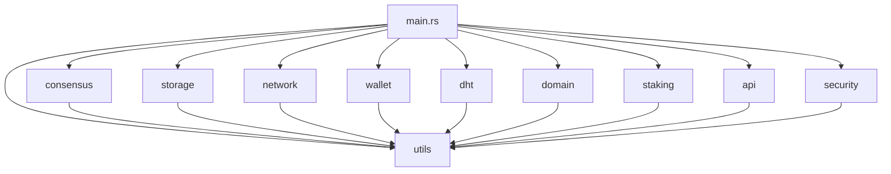

# 👨‍💻 IPPAN Developer Guide

Welcome to the IPPAN Developer Guide! This document provides comprehensive information for developers who want to understand, extend, or contribute to the IPPAN ecosystem.

## Table of Contents

1. [Architecture Overview](#architecture-overview)
2. [Development Setup](#development-setup)
3. [Codebase Structure](#codebase-structure)
4. [Core Components](#core-components)
5. [API Development](#api-development)
6. [Testing](#testing)
7. [Performance Optimization](#performance-optimization)
8. [Security Guidelines](#security-guidelines)
9. [Contributing](#contributing)
10. [Deployment](#deployment)

## Architecture Overview

### System Architecture

```
┌─────────────────────────────────────────────────────────────┐
│                    IPPAN Node                              │
├─────────────────────────────────────────────────────────────┤
│  ┌─────────────┐  ┌─────────────┐  ┌─────────────┐       │
│  │  Consensus  │  │   Storage   │  │   Network   │       │
│  │   Engine    │  │  Orchestrator│  │   Manager   │       │
│  └─────────────┘  └─────────────┘  └─────────────┘       │
├─────────────────────────────────────────────────────────────┤
│  ┌─────────────┐  ┌─────────────┐  ┌─────────────┐       │
│  │    Wallet   │  │     DHT     │  │     API     │       │
│  │   Manager   │  │   Manager   │  │   Layer     │       │
│  └─────────────┘  └─────────────┘  └─────────────┘       │
├─────────────────────────────────────────────────────────────┤
│  ┌─────────────┐  ┌─────────────┐  ┌─────────────┐       │
│  │    Domain   │  │   Staking   │  │   Security  │       │
│  │   System    │  │   System    │  │   Manager   │       │
│  └─────────────┘  └─────────────┘  └─────────────┘       │
└─────────────────────────────────────────────────────────────┘
```

### Key Design Principles

1. **Modularity**: Each component is self-contained with clear interfaces
2. **Security**: Security-first design with comprehensive auditing
3. **Performance**: Optimized for high-throughput operations
4. **Scalability**: Horizontal scaling through DHT and sharding
5. **Reliability**: Fault-tolerant design with consensus mechanisms

## Development Setup

### Prerequisites

```bash
# Required tools
rustc >= 1.70
cargo >= 1.70
git >= 2.30
clang/llvm (for some dependencies)

# Optional but recommended
cargo-audit
cargo-clippy
cargo-fmt
cargo-tarpaulin
```

### Development Environment

```bash
# Clone the repository
git clone https://github.com/ippan/ippan.git
cd ippan

# Install development dependencies
rustup component add clippy
rustup component add rustfmt
cargo install cargo-audit
cargo install cargo-tarpaulin

# Build in development mode
cargo build

# Run tests
cargo test

# Run clippy
cargo clippy

# Format code
cargo fmt
```

### IDE Setup

#### VS Code

```json
// .vscode/settings.json
{
    "rust-analyzer.checkOnSave.command": "clippy",
    "rust-analyzer.cargo.buildScripts.enable": true,
    "rust-analyzer.procMacro.enable": true,
    "rust-analyzer.cargo.loadOutDirsFromCheck": true
}
```

#### IntelliJ IDEA / CLion

1. Install Rust plugin
2. Configure Rust toolchain
3. Enable clippy integration

### Development Tools

```bash
# Install development tools
cargo install cargo-watch
cargo install cargo-expand
cargo install cargo-tree

# Set up pre-commit hooks
cp scripts/pre-commit .git/hooks/
chmod +x .git/hooks/pre-commit
```

## Codebase Structure

```
ippan/
├── src/
│   ├── main.rs              # Application entry point
│   ├── lib.rs               # Library exports
│   ├── consensus/           # BlockDAG consensus engine
│   ├── storage/             # Storage orchestrator
│   ├── network/             # P2P network layer
│   ├── wallet/              # Wallet and payment system
│   ├── dht/                 # Distributed hash table
│   ├── domain/              # Domain name system
│   ├── staking/             # Staking and rewards
│   ├── api/                 # REST and WebSocket APIs
│   ├── security/            # Security auditing and monitoring
│   ├── utils/               # Common utilities
│   └── tests/               # Integration tests
├── benches/                 # Performance benchmarks
├── docs/                    # Documentation
├── scripts/                 # Build and deployment scripts
├── config/                  # Configuration files
└── deployments/             # Deployment configurations
```

### Module Dependencies



## Core Components

### Consensus Engine

The consensus engine implements the BlockDAG protocol with HashTimers:

```rust
use ippan::consensus::{ConsensusEngine, ConsensusConfig, Block, Transaction};

// Create consensus engine
let config = ConsensusConfig::default();
let mut consensus = ConsensusEngine::new(config)?;

// Create a block
let transactions = vec![transaction1, transaction2];
let block = consensus.create_block(transactions, parent_hash)?;

// Validate block
consensus.validate_block(&block)?;

// Add block to DAG
consensus.add_block(block)?;
```

### Storage Orchestrator

The storage orchestrator manages encrypted, sharded storage:

```rust
use ippan::storage::{StorageOrchestrator, StorageConfig};

// Create storage orchestrator
let config = StorageConfig::default();
let mut storage = StorageOrchestrator::new(config)?;

// Upload file
let file_hash = storage.upload_file("document.txt", &file_data)?;

// Download file
let file_data = storage.download_file(&file_hash)?;

// Generate storage proof
let proof = storage.generate_storage_proof(&file_hash)?;
```

### Network Manager

The network manager handles P2P communication:

```rust
use ippan::network::{NetworkManager, NetworkConfig};

// Create network manager
let config = NetworkConfig::default();
let mut network = NetworkManager::new(config)?;

// Start network
network.start()?;

// Send message to peer
network.send_message(&peer_id, &message)?;

// Broadcast message
network.broadcast_message(&message)?;
```

### Wallet Manager

The wallet manager handles payments and M2M transactions:

```rust
use ippan::wallet::{WalletManager, WalletConfig};

// Create wallet manager
let config = WalletConfig::default();
let mut wallet = WalletManager::new(config)?;

// Send payment
wallet.send_payment(&recipient, amount)?;

// Create M2M payment channel
let channel = wallet.create_payment_channel(
    "sender",
    "recipient",
    10000,
    24
)?;

// Process micro-payment
wallet.process_micro_payment(&channel.channel_id, 100)?;
```

## API Development

### REST API Structure

```rust
use ippan::api::{ApiServer, ApiConfig};

// Create API server
let config = ApiConfig::default();
let mut api = ApiServer::new(config)?;

// Register routes
api.register_route("GET", "/api/v1/status", status_handler);
api.register_route("POST", "/api/v1/storage/upload", upload_handler);
api.register_route("GET", "/api/v1/storage/download/{hash}", download_handler);

// Start API server
api.start()?;
```

### WebSocket API

```rust
use ippan::api::websocket::{WebSocketServer, WebSocketHandler};

// Create WebSocket handler
struct MyWebSocketHandler;

impl WebSocketHandler for MyWebSocketHandler {
    fn on_connect(&self, connection_id: String) {
        println!("Client connected: {}", connection_id);
    }
    
    fn on_message(&self, connection_id: String, message: String) {
        // Handle incoming message
    }
    
    fn on_disconnect(&self, connection_id: String) {
        println!("Client disconnected: {}", connection_id);
    }
}

// Create WebSocket server
let handler = MyWebSocketHandler;
let mut ws_server = WebSocketServer::new(handler)?;
ws_server.start()?;
```

### Custom API Endpoints

```rust
use ippan::api::{Request, Response, ApiHandler};

// Custom API handler
struct CustomHandler;

impl ApiHandler for CustomHandler {
    fn handle(&self, request: Request) -> Response {
        match request.path.as_str() {
            "/api/v1/custom" => {
                Response::json(json!({
                    "message": "Custom endpoint",
                    "timestamp": chrono::Utc::now()
                }))
            }
            _ => Response::not_found()
        }
    }
}

// Register custom handler
api.register_handler(Box::new(CustomHandler));
```

## Testing

### Unit Testing

```rust
#[cfg(test)]
mod tests {
    use super::*;

    #[test]
    fn test_consensus_block_creation() {
        let config = ConsensusConfig::default();
        let mut consensus = ConsensusEngine::new(config).unwrap();
        
        let transaction = Transaction::new(
            [1u8; 32],
            1000,
            [2u8; 32],
            HashTimer::new()
        );
        
        let block = consensus.create_block(vec![transaction], [0u8; 32]).unwrap();
        assert!(consensus.validate_block(&block).is_ok());
    }
}
```

### Integration Testing

```rust
#[tokio::test]
async fn test_full_node_operation() {
    // Create test node
    let mut node = IppanNode::new(NodeConfig::default()).unwrap();
    node.start().await.unwrap();
    
    // Test storage operations
    let file_data = b"test file content";
    let hash = node.storage.upload_file("test.txt", file_data).unwrap();
    
    // Test download
    let downloaded = node.storage.download_file(&hash).unwrap();
    assert_eq!(file_data, downloaded.as_slice());
    
    // Test network operations
    let peers = node.network.get_connected_peers();
    assert!(peers.len() >= 0);
    
    node.stop().await.unwrap();
}
```

### Performance Testing

```rust
#[bench]
fn benchmark_block_creation(b: &mut Bencher) {
    let config = ConsensusConfig::default();
    let mut consensus = ConsensusEngine::new(config).unwrap();
    
    b.iter(|| {
        let transactions = (0..10).map(|i| {
            Transaction::new([i as u8; 32], 1000, [0u8; 32], HashTimer::new())
        }).collect();
        
        consensus.create_block(transactions, [0u8; 32]).unwrap()
    });
}
```

### Security Testing

```rust
#[test]
fn test_security_vulnerabilities() {
    let auditor = SecurityAuditor::new(AuditorConfig::default());
    let results = auditor.audit_codebase(Path::new(".")).await.unwrap();
    
    // Check for critical vulnerabilities
    let critical_vulns: Vec<_> = results.vulnerabilities.iter()
        .filter(|v| v.level == VulnerabilityLevel::Critical)
        .collect();
    
    assert_eq!(critical_vulns.len(), 0, "Critical vulnerabilities found");
}
```

## Performance Optimization

### Profiling

```bash
# Install profiling tools
cargo install flamegraph
cargo install cargo-instruments

# Generate flamegraph
cargo flamegraph --bin ippan

# Profile with instruments (macOS)
cargo instruments --bin ippan
```

### Benchmarking

```bash
# Run all benchmarks
cargo bench

# Run specific benchmark
cargo bench --bench consensus_benchmarks

# Generate benchmark report
cargo bench -- --output-format=json > benchmark_results.json
```

### Memory Optimization

```rust
// Use memory pools for frequent allocations
use ippan::utils::optimization::MemoryPool;

let pool = MemoryPool::new(100, 1024);
let chunk = pool.allocate().unwrap();

// Use connection pooling
use ippan::utils::optimization::ConnectionPool;

let pool = ConnectionPool::new(50, Duration::from_secs(300));
```

### Async Optimization

```rust
// Use async/await for I/O operations
async fn process_transactions(transactions: Vec<Transaction>) -> Result<()> {
    let mut handles = Vec::new();
    
    for transaction in transactions {
        let handle = tokio::spawn(async move {
            process_transaction(transaction).await
        });
        handles.push(handle);
    }
    
    // Wait for all transactions to complete
    for handle in handles {
        handle.await??;
    }
    
    Ok(())
}
```

## Security Guidelines

### Code Security

```rust
// Always validate input
fn process_user_input(input: &str) -> Result<()> {
    if input.len() > MAX_INPUT_SIZE {
        return Err(Error::InputTooLarge);
    }
    
    // Sanitize input
    let sanitized = sanitize_input(input);
    
    // Process sanitized input
    process_sanitized_input(&sanitized)
}

// Use secure random number generation
use rand::Rng;
let mut rng = rand::thread_rng();
let random_bytes: [u8; 32] = rng.gen();

// Validate cryptographic operations
fn verify_signature(message: &[u8], signature: &[u8], public_key: &[u8]) -> Result<bool> {
    // Use constant-time comparison
    if signature.len() != 64 {
        return Ok(false);
    }
    
    crypto::verify(message, signature, public_key)
}
```

### Security Testing

```rust
#[test]
fn test_input_validation() {
    // Test oversized input
    let oversized_input = "a".repeat(MAX_INPUT_SIZE + 1);
    assert!(process_user_input(&oversized_input).is_err());
    
    // Test malicious input
    let malicious_input = "<script>alert('xss')</script>";
    let result = process_user_input(malicious_input);
    assert!(result.is_ok());
    
    // Verify input was sanitized
    let processed = result.unwrap();
    assert!(!processed.contains("<script>"));
}
```

## Contributing

### Development Workflow

1. **Fork the repository**
   ```bash
   git clone https://github.com/your-username/ippan.git
   cd ippan
   git remote add upstream https://github.com/ippan/ippan.git
   ```

2. **Create a feature branch**
   ```bash
   git checkout -b feature/your-feature-name
   ```

3. **Make your changes**
   ```rust
   // Add your code here
   ```

4. **Run tests**
   ```bash
   cargo test
   cargo clippy
   cargo fmt
   ```

5. **Submit a pull request**
   ```bash
   git add .
   git commit -m "Add feature: your feature description"
   git push origin feature/your-feature-name
   ```

### Code Style Guidelines

```rust
// Use meaningful variable names
let transaction_count = transactions.len();
let block_hash = calculate_block_hash(&block);

// Use proper error handling
fn process_data(data: &[u8]) -> Result<ProcessedData> {
    if data.is_empty() {
        return Err(Error::EmptyData);
    }
    
    // Process data
    let processed = process_bytes(data)?;
    Ok(processed)
}

// Use documentation comments
/// Processes a transaction and adds it to the mempool.
///
/// # Arguments
///
/// * `transaction` - The transaction to process
/// * `network` - The network manager for broadcasting
///
/// # Returns
///
/// Returns `Ok(())` if the transaction was processed successfully,
/// or an error if processing failed.
pub async fn process_transaction(
    transaction: Transaction,
    network: &NetworkManager,
) -> Result<()> {
    // Implementation here
}
```

### Commit Message Guidelines

```
type(scope): description

[optional body]

[optional footer]
```

Examples:
```
feat(consensus): add new block validation rule
fix(storage): resolve memory leak in file upload
docs(api): update REST API documentation
test(wallet): add comprehensive payment tests
```

## Deployment

### Development Deployment

```bash
# Build for development
cargo build

# Run with development configuration
cargo run --bin ippan -- --config config/dev.toml

# Run with debug logging
RUST_LOG=debug cargo run --bin ippan
```

### Production Deployment

```bash
# Build for production
cargo build --release

# Create production configuration
cp config/default.toml config/production.toml
# Edit production.toml with production settings

# Run production node
cargo run --release --bin ippan -- --config config/production.toml
```

### Docker Deployment

```dockerfile
# Dockerfile
FROM rust:1.70 as builder
WORKDIR /usr/src/ippan
COPY . .
RUN cargo build --release

FROM debian:bullseye-slim
RUN apt-get update && apt-get install -y ca-certificates && rm -rf /var/lib/apt/lists/*
COPY --from=builder /usr/src/ippan/target/release/ippan /usr/local/bin/ippan
EXPOSE 8080 3000
CMD ["ippan", "node", "start"]
```

### Kubernetes Deployment

```yaml
# k8s/deployment.yaml
apiVersion: apps/v1
kind: Deployment
metadata:
  name: ippan-node
spec:
  replicas: 3
  selector:
    matchLabels:
      app: ippan-node
  template:
    metadata:
      labels:
        app: ippan-node
    spec:
      containers:
      - name: ippan
        image: ippan/ippan:latest
        ports:
        - containerPort: 8080
        - containerPort: 3000
        volumeMounts:
        - name: ippan-data
          mountPath: /data
      volumes:
      - name: ippan-data
        persistentVolumeClaim:
          claimName: ippan-pvc
```

## Monitoring and Observability

### Logging

```rust
use tracing::{info, warn, error, debug};

// Structured logging
info!(
    transaction_id = %tx.id,
    amount = tx.amount,
    "Processing transaction"
);

// Error logging with context
error!(
    error = %e,
    peer_id = %peer_id,
    "Failed to connect to peer"
);
```

### Metrics

```rust
use ippan::utils::performance::PerformanceProfiler;

let profiler = PerformanceProfiler::new(ProfilerConfig::default());

// Record metrics
profiler.record_metric(
    "consensus".to_string(),
    "block_creation".to_string(),
    duration
);

// Export metrics
let metrics_json = profiler.export_metrics_json();
```

### Health Checks

```rust
// Health check endpoint
async fn health_check() -> Response {
    let status = check_system_health().await;
    
    match status {
        HealthStatus::Healthy => Response::json(json!({
            "status": "healthy",
            "timestamp": chrono::Utc::now()
        })),
        HealthStatus::Degraded => Response::json(json!({
            "status": "degraded",
            "issues": status.issues
        })),
        HealthStatus::Unhealthy => Response::json(json!({
            "status": "unhealthy",
            "errors": status.errors
        }))
    }
}
```

---

**Happy Coding! 🚀**

For more information, visit:
- [IPPAN Documentation](https://docs.ippan.net)
- [IPPAN GitHub](https://github.com/ippan/ippan)
- [IPPAN Discord](https://discord.gg/ippan) 