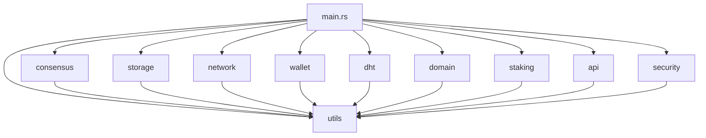

# 👨‍💻 IPPAN Developer Guide

Welcome to the IPPAN Developer Guide! This document provides comprehensive information for developers who want to understand, extend, or contribute to the **global Layer-1 blockchain** with **1-10 million TPS** capacity.

## 🚀 Global L1 Blockchain Development

IPPAN is designed as a **global Layer-1 blockchain** targeting **1-10 million transactions per second** for planetary-scale adoption. This guide covers development practices optimized for high-performance, scalable blockchain development.

## Table of Contents

1. [Architecture Overview](#architecture-overview)
2. [Development Setup](#development-setup)
3. [Codebase Structure](#codebase-structure)
4. [Core Components](#core-components)
5. [API Development](#api-development)
6. [Testing](#testing)
7. [Performance Optimization](#performance-optimization)
8. [1-10M TPS Development](#1-10m-tps-development)
9. [Security Guidelines](#security-guidelines)
10. [Contributing](#contributing)
11. [Deployment](#deployment)

## Architecture Overview

### System Architecture

```
┌─────────────────────────────────────────────────────────────┐
│                    IPPAN Node                              │
├─────────────────────────────────────────────────────────────┤
│  ┌─────────────┐  ┌─────────────┐  ┌─────────────┐       │
│  │  Consensus  │  │   Storage   │  │   Network   │       │
│  │   Engine    │  │  Orchestrator│  │   Manager   │       │
│  └─────────────┘  └─────────────┘  └─────────────┘       │
├─────────────────────────────────────────────────────────────┤
│  ┌─────────────┐  ┌─────────────┐  ┌─────────────┐       │
│  │    Wallet   │  │     DHT     │  │     API     │       │
│  │   Manager   │  │   Manager   │  │   Layer     │       │
│  └─────────────┘  └─────────────┘  └─────────────┘       │
├─────────────────────────────────────────────────────────────┤
│  ┌─────────────┐  ┌─────────────┐  ┌─────────────┐       │
│  │    Domain   │  │   Staking   │  │   Security  │       │
│  │   System    │  │   System    │  │   Manager   │       │
│  └─────────────┘  └─────────────┘  └─────────────┘       │
└─────────────────────────────────────────────────────────────┘
```

### Key Design Principles

1. **Modularity**: Each component is self-contained with clear interfaces
2. **Security**: Security-first design with comprehensive auditing
3. **Performance**: Optimized for high-throughput operations
4. **Scalability**: Horizontal scaling through DHT and sharding
5. **Reliability**: Fault-tolerant design with consensus mechanisms

## Development Setup

### Prerequisites

```bash
# Required tools
rustc >= 1.70
cargo >= 1.70
git >= 2.30
clang/llvm (for some dependencies)

# Optional but recommended
cargo-audit
cargo-clippy
cargo-fmt
cargo-tarpaulin
```

### Development Environment

```bash
# Clone the repository
git clone https://github.com/ippan/ippan.git
cd ippan

# Install development dependencies
rustup component add clippy
rustup component add rustfmt
cargo install cargo-audit
cargo install cargo-tarpaulin

# Build in development mode
cargo build

# Run tests
cargo test

# Run clippy
cargo clippy

# Format code
cargo fmt
```

### IDE Setup

#### VS Code

```json
// .vscode/settings.json
{
    "rust-analyzer.checkOnSave.command": "clippy",
    "rust-analyzer.cargo.buildScripts.enable": true,
    "rust-analyzer.procMacro.enable": true,
    "rust-analyzer.cargo.loadOutDirsFromCheck": true
}
```

#### IntelliJ IDEA / CLion

1. Install Rust plugin
2. Configure Rust toolchain
3. Enable clippy integration

### Development Tools

```bash
# Install development tools
cargo install cargo-watch
cargo install cargo-expand
cargo install cargo-tree

# Set up pre-commit hooks
cp scripts/pre-commit .git/hooks/
chmod +x .git/hooks/pre-commit
```

## Codebase Structure

```
ippan/
├── src/
│   ├── main.rs              # Application entry point
│   ├── lib.rs               # Library exports
│   ├── consensus/           # BlockDAG consensus engine
│   ├── storage/             # Storage orchestrator
│   ├── network/             # P2P network layer
│   ├── wallet/              # Wallet and payment system
│   ├── dht/                 # Distributed hash table
│   ├── domain/              # Domain name system
│   ├── staking/             # Staking and rewards
│   ├── api/                 # REST and WebSocket APIs
│   ├── security/            # Security auditing and monitoring
│   ├── utils/               # Common utilities
│   └── tests/               # Integration tests
├── benches/                 # Performance benchmarks
├── docs/                    # Documentation
├── scripts/                 # Build and deployment scripts
├── config/                  # Configuration files
└── deployments/             # Deployment configurations
```

### Module Dependencies



## Core Components

### Consensus Engine

The consensus engine implements the BlockDAG protocol with ZK-STARK proofs and HashTimers:

```rust
use ippan::consensus::{ConsensusEngine, ConsensusConfig, Block, Transaction};

// Create consensus engine
let config = ConsensusConfig::default();
let mut consensus = ConsensusEngine::new(config)?;

// Create a block
let transactions = vec![transaction1, transaction2];
let block = consensus.create_block(transactions, parent_hash)?;

// Generate ZK-STARK proof for round
let zk_proof = consensus.generate_zk_proof(&round_state)?;

// Validate block with ZK-STARK proof
consensus.validate_block(&block, &zk_proof)?;

// Add block to DAG
consensus.add_block(block)?;
```

### Storage Orchestrator

The storage orchestrator manages encrypted, sharded storage:

```rust
use ippan::storage::{StorageOrchestrator, StorageConfig};

// Create storage orchestrator
let config = StorageConfig::default();
let mut storage = StorageOrchestrator::new(config)?;

// Upload file
let file_hash = storage.upload_file("document.txt", &file_data)?;

// Download file
let file_data = storage.download_file(&file_hash)?;

// Generate storage proof
let proof = storage.generate_storage_proof(&file_hash)?;
```

### Network Manager

The network manager handles P2P communication:

```rust
use ippan::network::{NetworkManager, NetworkConfig};

// Create network manager
let config = NetworkConfig::default();
let mut network = NetworkManager::new(config)?;

// Start network
network.start()?;

// Send message to peer
network.send_message(&peer_id, &message)?;

// Broadcast message
network.broadcast_message(&message)?;
```

### Wallet Manager

The wallet manager handles payments and M2M transactions:

```rust
use ippan::wallet::{WalletManager, WalletConfig};

// Create wallet manager
let config = WalletConfig::default();
let mut wallet = WalletManager::new(config)?;

// Send payment
wallet.send_payment(&recipient, amount)?;

// Create M2M payment channel
let channel = wallet.create_payment_channel(
    "sender",
    "recipient",
    10000,
    24
)?;

// Process micro-payment
wallet.process_micro_payment(&channel.channel_id, 100)?;
```

## API Development

### REST API Structure

```rust
use ippan::api::{ApiServer, ApiConfig};

// Create API server
let config = ApiConfig::default();
let mut api = ApiServer::new(config)?;

// Register routes
api.register_route("GET", "/api/v1/status", status_handler);
api.register_route("POST", "/api/v1/storage/upload", upload_handler);
api.register_route("GET", "/api/v1/storage/download/{hash}", download_handler);

// Start API server
api.start()?;
```

### WebSocket API

```rust
use ippan::api::websocket::{WebSocketServer, WebSocketHandler};

// Create WebSocket handler
struct MyWebSocketHandler;

impl WebSocketHandler for MyWebSocketHandler {
    fn on_connect(&self, connection_id: String) {
        println!("Client connected: {}", connection_id);
    }
    
    fn on_message(&self, connection_id: String, message: String) {
        // Handle incoming message
    }
    
    fn on_disconnect(&self, connection_id: String) {
        println!("Client disconnected: {}", connection_id);
    }
}

// Create WebSocket server
let handler = MyWebSocketHandler;
let mut ws_server = WebSocketServer::new(handler)?;
ws_server.start()?;
```

### Custom API Endpoints

```rust
use ippan::api::{Request, Response, ApiHandler};

// Custom API handler
struct CustomHandler;

impl ApiHandler for CustomHandler {
    fn handle(&self, request: Request) -> Response {
        match request.path.as_str() {
            "/api/v1/custom" => {
                Response::json(json!({
                    "message": "Custom endpoint",
                    "timestamp": chrono::Utc::now()
                }))
            }
            _ => Response::not_found()
        }
    }
}

// Register custom handler
api.register_handler(Box::new(CustomHandler));
```

## Testing

### Unit Testing

```rust
#[cfg(test)]
mod tests {
    use super::*;

    #[test]
    fn test_consensus_block_creation() {
        let config = ConsensusConfig::default();
        let mut consensus = ConsensusEngine::new(config).unwrap();
        
        let transaction = Transaction::new(
            [1u8; 32],
            1000,
            [2u8; 32],
            HashTimer::new()
        );
        
        let block = consensus.create_block(vec![transaction], [0u8; 32]).unwrap();
        assert!(consensus.validate_block(&block).is_ok());
    }
}
```

### Integration Testing

```rust
#[tokio::test]
async fn test_full_node_operation() {
    // Create test node
    let mut node = IppanNode::new(NodeConfig::default()).unwrap();
    node.start().await.unwrap();
    
    // Test storage operations
    let file_data = b"test file content";
    let hash = node.storage.upload_file("test.txt", file_data).unwrap();
    
    // Test download
    let downloaded = node.storage.download_file(&hash).unwrap();
    assert_eq!(file_data, downloaded.as_slice());
    
    // Test network operations
    let peers = node.network.get_connected_peers();
    assert!(peers.len() >= 0);
    
    node.stop().await.unwrap();
}
```

### Performance Testing

```rust
#[bench]
fn benchmark_block_creation(b: &mut Bencher) {
    let config = ConsensusConfig::default();
    let mut consensus = ConsensusEngine::new(config).unwrap();
    
    b.iter(|| {
        let transactions = (0..10).map(|i| {
            Transaction::new([i as u8; 32], 1000, [0u8; 32], HashTimer::new())
        }).collect();
        
        consensus.create_block(transactions, [0u8; 32]).unwrap()
    });
}
```

### Security Testing

```rust
#[test]
fn test_security_vulnerabilities() {
    let auditor = SecurityAuditor::new(AuditorConfig::default());
    let results = auditor.audit_codebase(Path::new(".")).await.unwrap();
    
    // Check for critical vulnerabilities
    let critical_vulns: Vec<_> = results.vulnerabilities.iter()
        .filter(|v| v.level == VulnerabilityLevel::Critical)
        .collect();
    
    assert_eq!(critical_vulns.len(), 0, "Critical vulnerabilities found");
}
```

## Performance Optimization

### Profiling

```bash
# Install profiling tools
cargo install flamegraph
cargo install cargo-instruments

# Generate flamegraph
cargo flamegraph --bin ippan

# Profile with instruments (macOS)
cargo instruments --bin ippan
```

### Benchmarking

```bash
# Run all benchmarks
cargo bench

# Run specific benchmark
cargo bench --bench consensus_benchmarks

# Generate benchmark report
cargo bench -- --output-format=json > benchmark_results.json
```

### Memory Optimization

```rust
// Use memory pools for frequent allocations
use ippan::utils::optimization::MemoryPool;

let pool = MemoryPool::new(100, 1024);
let chunk = pool.allocate().unwrap();

// Use connection pooling
use ippan::utils::optimization::ConnectionPool;

let pool = ConnectionPool::new(50, Duration::from_secs(300));
```

### Async Optimization

```rust
// Use async/await for I/O operations
async fn process_transactions(transactions: Vec<Transaction>) -> Result<()> {
    let mut handles = Vec::new();
    
    for transaction in transactions {
        let handle = tokio::spawn(async move {
            process_transaction(transaction).await
        });
        handles.push(handle);
    }
    
    // Wait for all transactions to complete
    for handle in handles {
        handle.await??;
    }
    
    Ok(())
}
```

## 1-10M TPS Development

### 🎯 Performance Targets

IPPAN targets **1-10 million transactions per second** through the following phases:

#### Phase 1: 1M TPS (Q2 2024)
- **Goal:** Achieve 1 million TPS baseline
- **Focus:** Core optimization and parallel processing
- **Metrics:** Transaction throughput, latency, finality

#### Phase 2: 5M TPS (Q4 2024)
- **Goal:** Scale to 5 million TPS
- **Focus:** Advanced sharding and network optimization
- **Metrics:** Cross-shard communication, load balancing

#### Phase 3: 10M TPS (2025)
- **Goal:** Reach 10 million TPS for global scale
- **Focus:** Global distribution and advanced optimizations
- **Metrics:** Global network performance, geographic distribution

### 🚀 Development Guidelines for High TPS

#### 1. **Parallel Processing**
```rust
// Use async/await for concurrent operations
pub async fn process_transactions_parallel(
    transactions: Vec<Transaction>
) -> Result<Vec<TransactionResult>> {
    let futures: Vec<_> = transactions
        .into_iter()
        .map(|tx| process_single_transaction(tx))
        .collect();
    
    futures::future::join_all(futures).await
}
```

#### 2. **Memory Optimization**
```rust
// Use efficient data structures
use std::collections::HashMap;
use parking_lot::RwLock; // More efficient than std::sync::RwLock

// Pre-allocate vectors when possible
let mut results = Vec::with_capacity(expected_size);
```

#### 3. **Network Optimization**
```rust
// Optimize network communication
pub async fn broadcast_transaction(
    transaction: &Transaction,
    peers: &[PeerId]
) -> Result<()> {
    // Use efficient serialization
    let data = bincode::serialize(transaction)?;
    
    // Parallel peer communication
    let futures: Vec<_> = peers
        .iter()
        .map(|peer| send_to_peer(peer, &data))
        .collect();
    
    futures::future::join_all(futures).await;
    Ok(())
}
```

#### 4. **Database Optimization**
```rust
// Use efficient database operations
pub async fn batch_insert_transactions(
    transactions: Vec<Transaction>
) -> Result<()> {
    // Batch operations for better performance
    let batch_size = 1000;
    
    for chunk in transactions.chunks(batch_size) {
        database.batch_insert(chunk).await?;
    }
    
    Ok(())
}
```

### 📊 Performance Monitoring

#### Key Metrics
- **TPS (Transactions Per Second):** Current throughput
- **Latency:** End-to-end transaction time
- **Finality:** Time to transaction confirmation
- **Memory Usage:** RAM consumption per node
- **Network I/O:** Bandwidth utilization
- **CPU Usage:** Processing overhead

#### Monitoring Tools
```rust
// Performance monitoring
use std::time::Instant;

pub async fn monitor_transaction_processing() {
    let start = Instant::now();
    
    // Process transactions
    let result = process_transactions(transactions).await?;
    
    let duration = start.elapsed();
    metrics::histogram!("transaction_processing_time", duration.as_millis() as f64);
    metrics::counter!("transactions_processed", result.len() as u64);
}
```

### 🔧 Optimization Techniques

#### 1. **Consensus Optimization**
- **BlockDAG:** Enable parallel block processing
- **Minimal Coordination:** Reduce consensus overhead
- **Fast Finality:** Quick transaction confirmation

#### 2. **Storage Optimization**
- **Sharding:** Distribute data across multiple shards
- **Caching:** Implement intelligent caching strategies
- **Compression:** Compress data for network efficiency

#### 3. **Network Optimization**
- **Geographic Distribution:** Nodes across continents
- **Load Balancing:** Automatic traffic distribution
- **Connection Pooling:** Reuse network connections

#### 4. **Memory Management**
- **Object Pooling:** Reuse objects to reduce allocation
- **Garbage Collection:** Optimize memory cleanup
- **Memory Mapping:** Use memory-mapped files for large datasets

### 🧪 Performance Testing

#### Load Testing
```bash
# Run load tests
cargo test --test load_tests -- --nocapture

# Benchmark specific components
cargo bench --bench transaction_processing
cargo bench --bench consensus_engine
cargo bench --bench storage_operations
```

#### Stress Testing
```rust
#[tokio::test]
async fn stress_test_transaction_processing() {
    let mut transactions = Vec::new();
    
    // Generate 1M test transactions
    for i in 0..1_000_000 {
        transactions.push(create_test_transaction(i));
    }
    
    let start = Instant::now();
    let results = process_transactions_parallel(transactions).await.unwrap();
    let duration = start.elapsed();
    
    let tps = results.len() as f64 / duration.as_secs_f64();
    println!("Achieved {} TPS", tps);
    
    assert!(tps >= 1_000_000.0, "Failed to achieve 1M TPS");
}
```

### 🌍 Global Scale Considerations

#### Geographic Distribution
- **Multi-Continent Deployment:** Nodes across all continents
- **Latency Optimization:** Low-latency connections between hubs
- **Regional Data Centers:** Optimize for local performance

#### Network Resilience
- **Redundant Paths:** Multiple network routes
- **Fault Tolerance:** Survive regional outages
- **Load Balancing:** Distribute load across regions

#### Scalability Planning
- **Horizontal Scaling:** Add more nodes for capacity
- **Vertical Scaling:** Optimize individual node performance
- **Sharding Strategy:** Distribute load across shards

### 🔗 L2 Blockchain Integration

#### **L2 Settlement Integration**
```rust
use ippan::crosschain::l2_integration::{L2Settlement, L2DataAvailability};

// Create L2 settlement transaction
let l2_settlement = L2Settlement {
    l2_chain_id: 12345,
    l2_block_hash: l2_block_hash,
    l2_state_root: l2_state_root,
    settlement_amount: 1000000000,
    metadata: l2_metadata,
};

// Submit L2 settlement to IPPAN
let tx_hash = consensus.submit_l2_settlement(l2_settlement).await?;
println!("L2 settlement submitted: {}", tx_hash);
```

#### **L2 Data Availability**
```rust
// Store L2 data on IPPAN's global DHT
let l2_data = L2DataAvailability {
    l2_chain_id: 12345,
    data_type: L2DataType::StateUpdate,
    data_hash: data_hash,
    data_size: data.len() as u64,
    data: data,
};

// Upload L2 data to IPPAN storage
let storage_result = storage.store_l2_data(l2_data).await?;
println!("L2 data stored: {}", storage_result.file_hash);
```

#### **L2 Cross-Chain Anchors**
```rust
use ippan::crosschain::anchor::CrossChainAnchor;

// Create cross-chain anchor for L2
let anchor = CrossChainAnchor {
    source_chain: "L2_Chain_A",
    target_chain: "IPPAN",
    state_hash: l2_state_hash,
    timestamp: current_time_ns(),
    proof: l2_proof,
};

// Submit anchor to IPPAN
let anchor_tx = consensus.submit_anchor(anchor).await?;
println!("L2 anchor submitted: {}", anchor_tx);
```

#### **L2 M2M Payment Integration**
```rust
// Enable M2M payments for L2 applications
let l2_m2m_channel = M2MChannel {
    l2_chain_id: 12345,
    recipient: l2_recipient,
    amount: 10000000000,
    duration_hours: 24,
    description: "L2 IoT device payments",
};

// Create M2M channel for L2
let channel = wallet.create_l2_m2m_channel(l2_m2m_channel).await?;
println!("L2 M2M channel created: {}", channel.channel_id);
```

#### **L2 Timestamping Service**
```rust
use ippan::consensus::hashtimer::create_l2_hashtimer;

// Create precision timestamp for L2 event
let l2_hashtimer = create_l2_hashtimer(
    &l2_event_hash,
    &l2_chain_id,
    &node_id
)?;

println!("L2 event timestamped: {} ns", l2_hashtimer.ippan_time_ns);
```

#### **L2 Integration Configuration**
```rust
// Configure L2 integration
let l2_config = L2IntegrationConfig {
    settlement_enabled: true,
    data_availability_enabled: true,
    anchor_enabled: true,
    m2m_enabled: true,
    timestamping_enabled: true,
    max_l2_chains: 1000,
    settlement_fee: 1000000, // 1 IPN cent
    data_storage_fee: 500000, // 0.5 IPN cent
};
```

### 🔐 ZK-STARK Development

#### **ZK-STARK Proof Generation**
```rust
use ippan::consensus::roundchain::zk_prover::{ZkProver, ZkProverConfig};

// Configure ZK-STARK prover
let config = ZkProverConfig {
    proof_size_target: 50_000, // 50 KB target
    verification_time_target: 50, // 50ms target
    security_level: 128, // 128-bit security
};

let mut zk_prover = ZkProver::new(config);

// Set round state for proof generation
zk_prover.set_round_state(&round_state)?;
zk_prover.set_block_list(&block_list)?;
zk_prover.set_state_transition(&state_transition)?;

// Generate ZK-STARK proof
let proof = zk_prover.generate_proof().await?;

println!("ZK-STARK proof generated: {} bytes", proof.len());
```

#### **ZK-STARK Proof Verification**
```rust
use ippan::consensus::roundchain::zk_prover::ZkStarkProof;

// Verify ZK-STARK proof
let is_valid = zk_prover.verify_proof(&proof, &round_state)?;

if is_valid {
    println!("ZK-STARK proof verified successfully");
} else {
    println!("ZK-STARK proof verification failed");
}
```

#### **Round Structure with ZK-STARK**
```rust
use ippan::consensus::roundchain::{
    RoundHeader, ZkStarkProof, RoundAggregation
};

// Create round with ZK-STARK proof
let round_header = RoundHeader {
    round_number: 12345,
    timestamp: current_time_ns(),
    validator_id: validator_public_key,
    block_count: block_list.len() as u32,
    zk_proof_reference: zk_proof.hash(),
};

let round_aggregation = RoundAggregation {
    header: round_header,
    block_list,
    zk_proof,
    validator_signatures: vec![],
};
```

#### **Performance Optimization for ZK-STARK**
```rust
// Parallel proof generation
pub async fn generate_parallel_proofs(
    round_states: Vec<RoundState>
) -> Result<Vec<ZkStarkProof>> {
    let futures: Vec<_> = round_states
        .into_iter()
        .map(|state| generate_single_proof(state))
        .collect();
    
    futures::future::join_all(futures).await
}

// Optimized verification
pub async fn verify_proofs_batch(
    proofs: Vec<ZkStarkProof>
) -> Result<Vec<bool>> {
    let mut results = Vec::with_capacity(proofs.len());
    
    for proof in proofs {
        let start = Instant::now();
        let is_valid = verify_single_proof(&proof).await?;
        let duration = start.elapsed();
        
        // Ensure verification time is under 50ms
        assert!(duration.as_millis() < 50, "ZK-STARK verification too slow");
        
        results.push(is_valid);
    }
    
    Ok(results)
}
```

#### **ZK-STARK Configuration**
```rust
// High-performance ZK-STARK configuration
let high_perf_config = ZkProverConfig {
    proof_size_target: 100_000, // 100 KB for higher security
    verification_time_target: 25, // 25ms for faster finality
    security_level: 256, // 256-bit security
    parallel_proving: true, // Enable parallel proof generation
    optimized_verification: true, // Use optimized verification
};
```

## Security Guidelines

### Code Security

```rust
// Always validate input
fn process_user_input(input: &str) -> Result<()> {
    if input.len() > MAX_INPUT_SIZE {
        return Err(Error::InputTooLarge);
    }
    
    // Sanitize input
    let sanitized = sanitize_input(input);
    
    // Process sanitized input
    process_sanitized_input(&sanitized)
}

// Use secure random number generation
use rand::Rng;
let mut rng = rand::thread_rng();
let random_bytes: [u8; 32] = rng.gen();

// Validate cryptographic operations
fn verify_signature(message: &[u8], signature: &[u8], public_key: &[u8]) -> Result<bool> {
    // Use constant-time comparison
    if signature.len() != 64 {
        return Ok(false);
    }
    
    crypto::verify(message, signature, public_key)
}
```

### Security Testing

```rust
#[test]
fn test_input_validation() {
    // Test oversized input
    let oversized_input = "a".repeat(MAX_INPUT_SIZE + 1);
    assert!(process_user_input(&oversized_input).is_err());
    
    // Test malicious input
    let malicious_input = "<script>alert('xss')</script>";
    let result = process_user_input(malicious_input);
    assert!(result.is_ok());
    
    // Verify input was sanitized
    let processed = result.unwrap();
    assert!(!processed.contains("<script>"));
}
```

## Contributing

### Development Workflow

1. **Fork the repository**
   ```bash
   git clone https://github.com/your-username/ippan.git
   cd ippan
   git remote add upstream https://github.com/ippan/ippan.git
   ```

2. **Create a feature branch**
   ```bash
   git checkout -b feature/your-feature-name
   ```

3. **Make your changes**
   ```rust
   // Add your code here
   ```

4. **Run tests**
   ```bash
   cargo test
   cargo clippy
   cargo fmt
   ```

5. **Submit a pull request**
   ```bash
   git add .
   git commit -m "Add feature: your feature description"
   git push origin feature/your-feature-name
   ```

### Code Style Guidelines

```rust
// Use meaningful variable names
let transaction_count = transactions.len();
let block_hash = calculate_block_hash(&block);

// Use proper error handling
fn process_data(data: &[u8]) -> Result<ProcessedData> {
    if data.is_empty() {
        return Err(Error::EmptyData);
    }
    
    // Process data
    let processed = process_bytes(data)?;
    Ok(processed)
}

// Use documentation comments
/// Processes a transaction and adds it to the mempool.
///
/// # Arguments
///
/// * `transaction` - The transaction to process
/// * `network` - The network manager for broadcasting
///
/// # Returns
///
/// Returns `Ok(())` if the transaction was processed successfully,
/// or an error if processing failed.
pub async fn process_transaction(
    transaction: Transaction,
    network: &NetworkManager,
) -> Result<()> {
    // Implementation here
}
```

### Commit Message Guidelines

```
type(scope): description

[optional body]

[optional footer]
```

Examples:
```
feat(consensus): add new block validation rule
fix(storage): resolve memory leak in file upload
docs(api): update REST API documentation
test(wallet): add comprehensive payment tests
```

## Deployment

### Development Deployment

```bash
# Build for development
cargo build

# Run with development configuration
cargo run --bin ippan -- --config config/dev.toml

# Run with debug logging
RUST_LOG=debug cargo run --bin ippan
```

### Production Deployment

```bash
# Build for production
cargo build --release

# Create production configuration
cp config/default.toml config/production.toml
# Edit production.toml with production settings

# Run production node
cargo run --release --bin ippan -- --config config/production.toml
```

### Docker Deployment

```dockerfile
# Dockerfile
FROM rust:1.70 as builder
WORKDIR /usr/src/ippan
COPY . .
RUN cargo build --release

FROM debian:bullseye-slim
RUN apt-get update && apt-get install -y ca-certificates && rm -rf /var/lib/apt/lists/*
COPY --from=builder /usr/src/ippan/target/release/ippan /usr/local/bin/ippan
EXPOSE 8080 3000
CMD ["ippan", "node", "start"]
```

### Kubernetes Deployment

```yaml
# k8s/deployment.yaml
apiVersion: apps/v1
kind: Deployment
metadata:
  name: ippan-node
spec:
  replicas: 3
  selector:
    matchLabels:
      app: ippan-node
  template:
    metadata:
      labels:
        app: ippan-node
    spec:
      containers:
      - name: ippan
        image: ippan/ippan:latest
        ports:
        - containerPort: 8080
        - containerPort: 3000
        volumeMounts:
        - name: ippan-data
          mountPath: /data
      volumes:
      - name: ippan-data
        persistentVolumeClaim:
          claimName: ippan-pvc
```

## Monitoring and Observability

### Logging

```rust
use tracing::{info, warn, error, debug};

// Structured logging
info!(
    transaction_id = %tx.id,
    amount = tx.amount,
    "Processing transaction"
);

// Error logging with context
error!(
    error = %e,
    peer_id = %peer_id,
    "Failed to connect to peer"
);
```

### Metrics

```rust
use ippan::utils::performance::PerformanceProfiler;

let profiler = PerformanceProfiler::new(ProfilerConfig::default());

// Record metrics
profiler.record_metric(
    "consensus".to_string(),
    "block_creation".to_string(),
    duration
);

// Export metrics
let metrics_json = profiler.export_metrics_json();
```

### Health Checks

```rust
// Health check endpoint
async fn health_check() -> Response {
    let status = check_system_health().await;
    
    match status {
        HealthStatus::Healthy => Response::json(json!({
            "status": "healthy",
            "timestamp": chrono::Utc::now()
        })),
        HealthStatus::Degraded => Response::json(json!({
            "status": "degraded",
            "issues": status.issues
        })),
        HealthStatus::Unhealthy => Response::json(json!({
            "status": "unhealthy",
            "errors": status.errors
        }))
    }
}
```

---

**Happy Coding! 🚀**

For more information, visit:
- [IPPAN Documentation](https://docs.ippan.net)
- [IPPAN GitHub](https://github.com/ippan/ippan)
- [IPPAN Discord](https://discord.gg/ippan) 

## TXT Metadata for Files and Servers

### **Implementation Details**
- **TXT Metadata Structure:**
  - Defined in `ipn_metadata.rs` with `IpTxtType` and `IpTxtRecord`.
- **Discovery and Storage:**
  - Implemented in `ipn_dht.rs` for storing and retrieving TXT records.
- **Verification Module:**
  - Located in `txt_verifier.rs` for signature and timestamp validation.
- **REST API:**
  - Developed in `txt_api.rs` to expose endpoints for TXT record management.
- **GUI Integration:**
  - Implemented in `gui_integration.rs` for displaying metadata in the user interface.
- **CLI Commands:**
  - Added in `cli.rs` for command-line management of TXT records.
- **On-Chain Transactions:**
  - Implemented in `txt_announce.rs` for optional on-chain anchoring of TXT records. 

## Archive Mode with Automatic Website Sync

### **Implementation Details**
- **Archive Mode Configuration:**
  - Added in `node_config.rs` to enable archive mode and configure sync targets.
- **Local Archive Store:**
  - Implemented in `tx_archive.rs` using RocksDB for storing validated transactions, file manifests, TXT records, and zk-STARK proofs.
- **Sync Uploader:**
  - Developed in `sync_uploader.rs` to handle background syncing of transactions to external APIs.
- **CLI Commands:**
  - Added in `cli.rs` for managing archive mode, including checking status and pushing transactions immediately.
- **API Specification:**
  - Updated in `api_spec.md` with the REST endpoint specification for receiving transactions at `ippan.net`. 